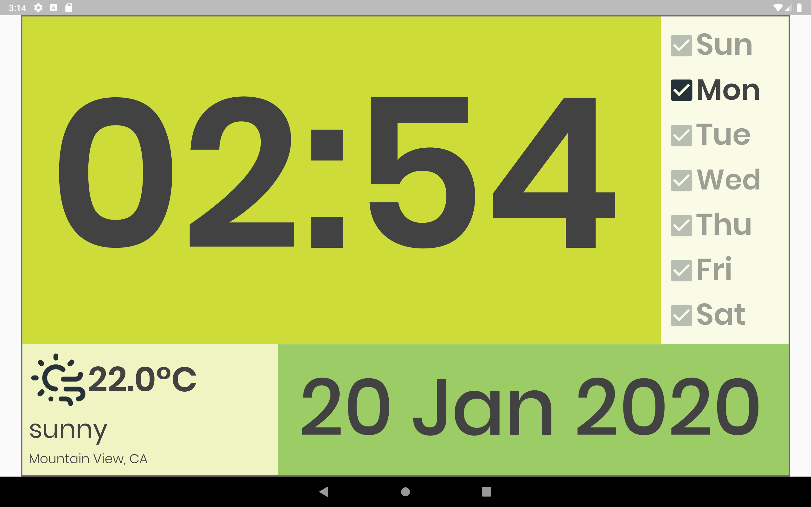
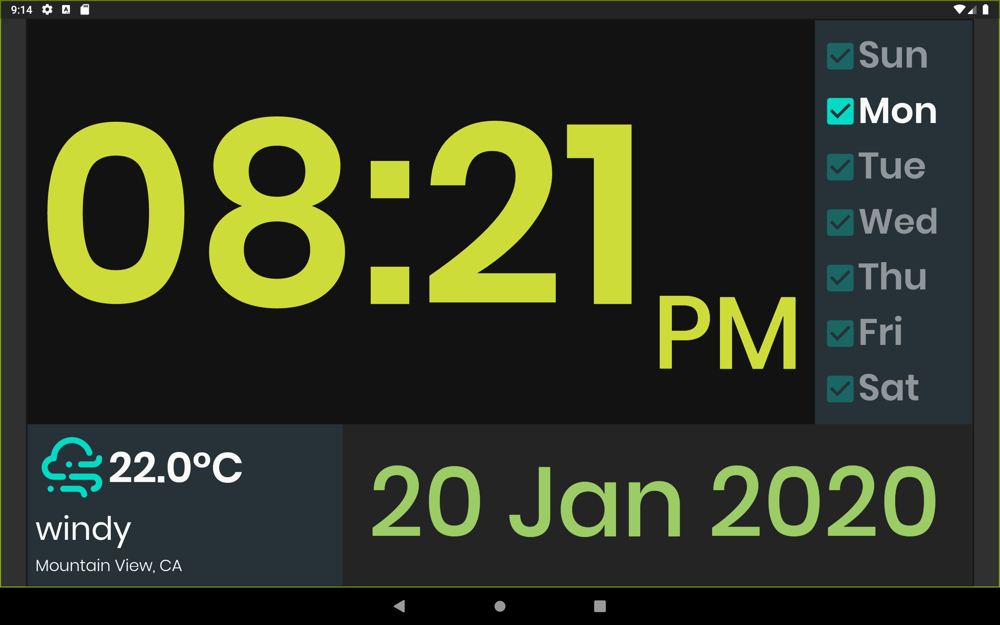
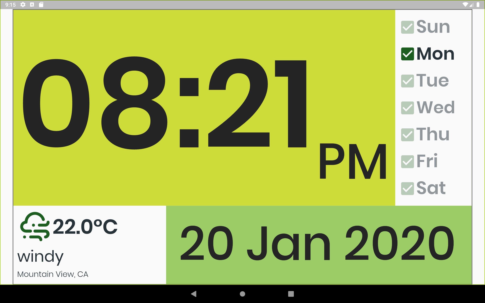
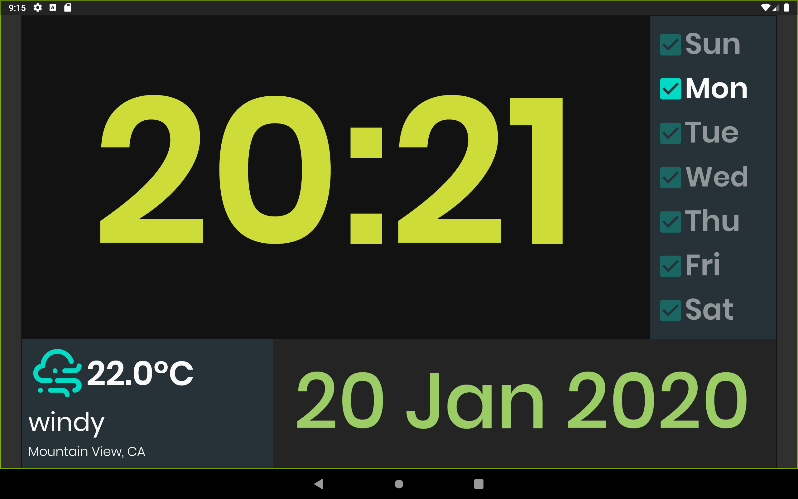
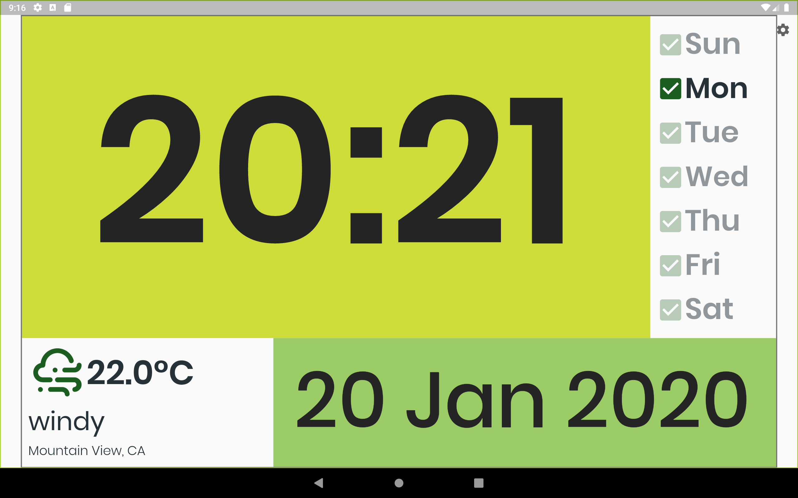

# Flutter Clock

Welcome to Flutter Clock!

See a Sample ScreenShot 

1.https://drive.google.com/file/d/12z_LGG2hVVU7ReA-bhRujTPVBa8j9IrF/view?usp=sharing ,

2.https://drive.google.com/file/d/1xQgrvfQ1SS8K8yF0ySawQJLIwvPfNvXV/view?usp=sharing ,

3.https://drive.google.com/file/d/1nbIrCtZmjeeeBQ8UPtbbC56NWIyjeevE/view?usp=sharing ,

4.https://drive.google.com/file/d/1tOX_K32vcXFPXw0e8JDiX4ENdpeqS40S/view?usp=sharing ,

5.https://drive.google.com/file/d/1whkv9XUmEDNkC3ldYO7oLc3zuLlmzE3T/view?usp=sharing ,

